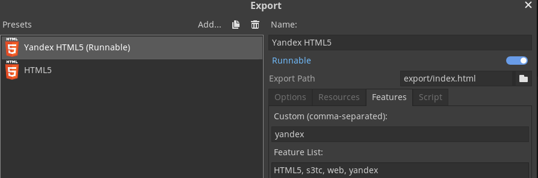

[ENG](./README.en.md) [RU](./README.md)

# Yandex games SDK for godot


Yandex games SDK *unofficial* implementation for godot.
I do it for my games, so it's not a complete SDK implementation yet.
If you lack of some functions, you can do it your self and contribute or create issue. I will be appreciate you.

## Get started

Just install plugin and add "yandex" feature to your export (see below).



## Methods

All methods stored in YandexSDK singleton.

### Yandex SDK initialization

```gdscript
YandexSDK.init_game() -> void
```

First method you need to call. If you don't, others methods won't work. It's just implement [start game method](https://yandex.ru/dev/games/doc/ru/sdk/sdk-gameready) from yandex sdk documentation.

### Display ad

```gdscript
YandexSDK.show_ad() -> void
```

Just show ad for user. Ad closing or cousing ad error will emmit **signal ad(result)**, result store 'closed' or 'error' String

### Display ad for a reward

```gdscript
YandexSDK.show_rewarded_ad() -> void
```

Show rewarded ad for user. Will emmit **signal rewarded_ad(result)**, result store 'closed', 'rewaeded', 'closed' or 'error' String

### Initialization of player data

```gdscript
YandexSDK.init_player() -> void
```

Initialization of player data, required for saves and other player related stuff. Methods below won't work, without this method calling.

### Saving player data

```gdscript
YandexSDK.save_data(data: Dictionary, flush: bool = false) -> void
```

Saves the user data. The maximum data size should not exceed 200 KB.

* **data**: Dictionary, an object containing key-value pairs.
* **flush**: Boolean, specifies the order data is sent in. If the value is "true", the data is immediately sent to the server. If it's "false" (default), the request to send data is queued.

### Saving player numerical data

```gdscript
YandexSDK.save_stats(stats: Dictionary) -> void
```

Saves the player's numeric data. The maximum data size must not exceed 10 KB.

* **stats**: Object, an object that contains key-value pairs where each value is a number.

### Loading player data

```gdscript
YandexSDK.load_data(keys: Array) -> void
```

Send request for get in-game player data, when done emmit **signal data_loaded(data)**, data is loaded Dictionary

* **keys**: array, the list of keys to return.

### Loading player numerical data

```gdscript
YandexSDK.load_stats(keys: Array) -> void
```

Send request for get player's numeric data, when done emit **signal stats_loaded(data)**, data is loaded Dictionary

* **keys**: array, the list of keys to return.

For more information check [official site](https://yandex.ru/dev/games/doc/en/sdk/sdk-player)
Sorry for may bad english, If you see some mistake in readme, you can contribute to fix it. I will be appreciate you.
